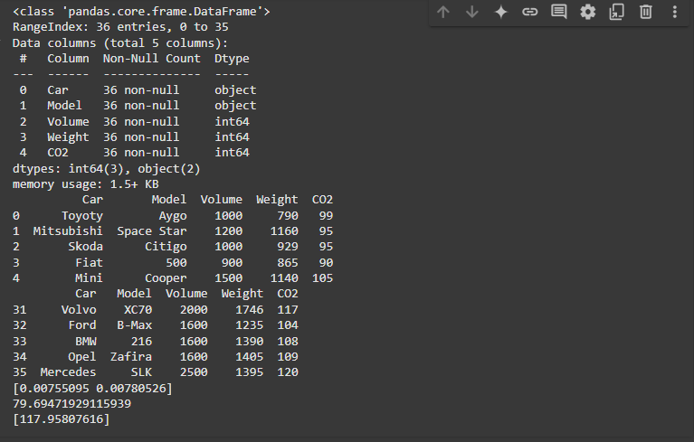

# Implementation of Multivariate Linear Regression
## Aim
To write a python program to implement multivariate linear regression and predict the output.
## Equipment’s required:
1.	Hardware – PCs
2.	Anaconda – Python 3.7 Installation / Moodle-Code Runner
## Algorithm:
### Step1
Import libraries and load the dataset using pd.read_csv().

### Step2
Inspect the dataset using info(), head(), and tail().

### Step3
Define features (x) and target (y) from the dataset.

### Step4
Train the Linear Regression model with fit().

### Step5
Retrieve coefficients, intercept, and predict CO2 for new input using predict().

## Program:
```
import pandas as pd
from sklearn.linear_model import LinearRegression

df = pd.read_csv('car.csv')
df.info()
print(df.head())
print(df.tail())

x = df[['Weight', 'Volume']]
y = df['CO2']

model = LinearRegression()
model.fit(x,y)
print(model.coef_)
print(model.intercept_)
input_data = pd.DataFrame({'Weight':[3000], 'Volume':[2000]})
ans = model.predict(input_data)
print(ans)
```
## Output:


## Result
Thus the multivariate linear regression is implemented and predicted the output using python program.